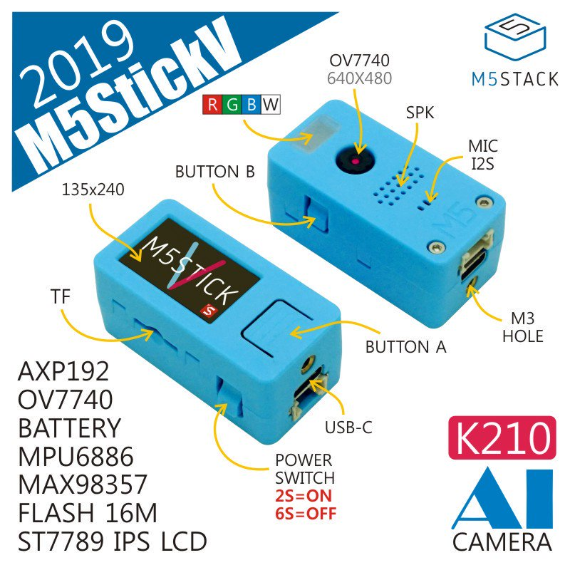
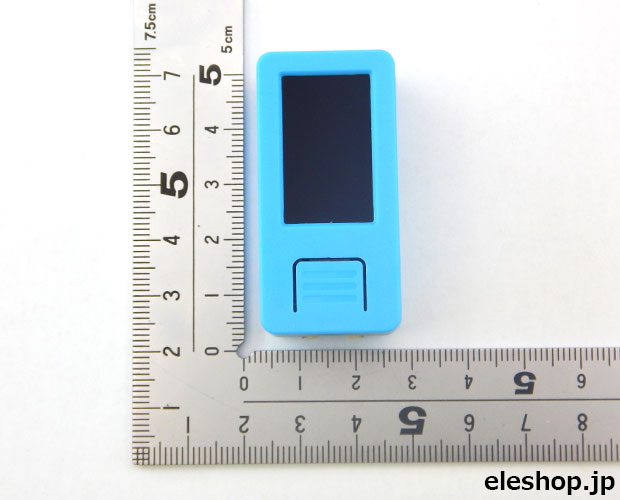

# Prop Gun Sight Using Live Face Tracking A.I.

## Features

 

* All-in-one solution utilizing the M5Stack M5StickV costing only [$35 on Amazon](https://www.amazon.com/Dual-core-M5Stick-V-OmniVision-Microphone-Recognition/dp/B07TXNXC3P/).
* M5StickV contains AI engine, display, speaker, camera, microphone, RGBW leds, gyroscope, buttons and rechargable battery.
* Live tracking of multiple faces using A.I.

## Future enhancements

* Various sound effects.
* "Tracking...", "Target 1 acquired...", etc. informational displays.
* Alert mode with red/blue flashing led.
* Possible voice commands.

## Requirements

* M5StickV with the most recent MAIXpy firmware.
* Micro SD card

## Installation

* Clone this repo, copy the files in the src directory to a newly formatted micro SD card. Insert card, turn on M5StickV. That's it!
